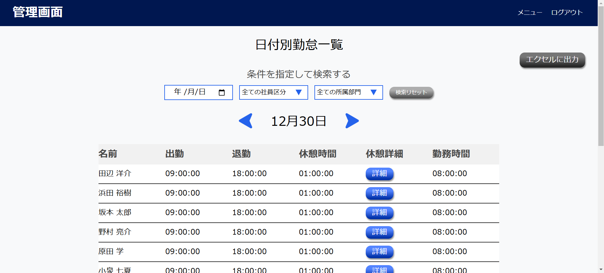
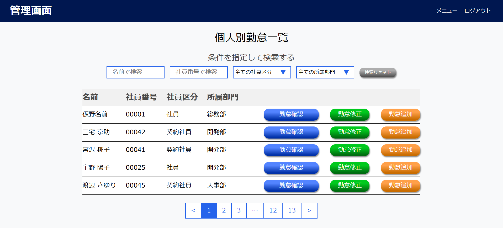
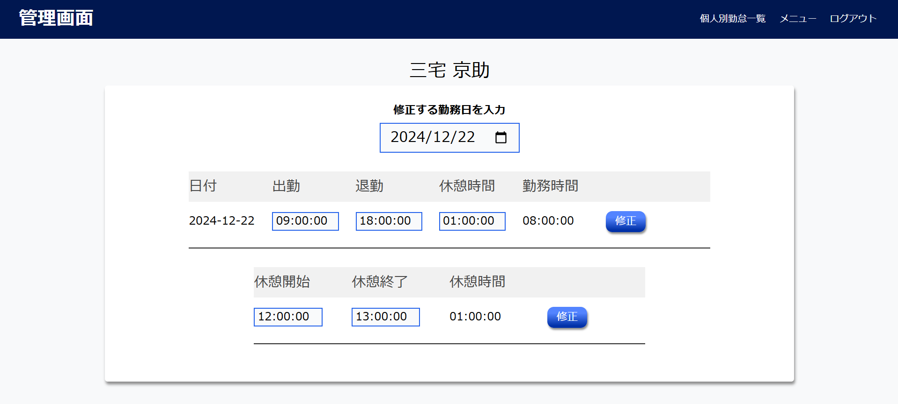
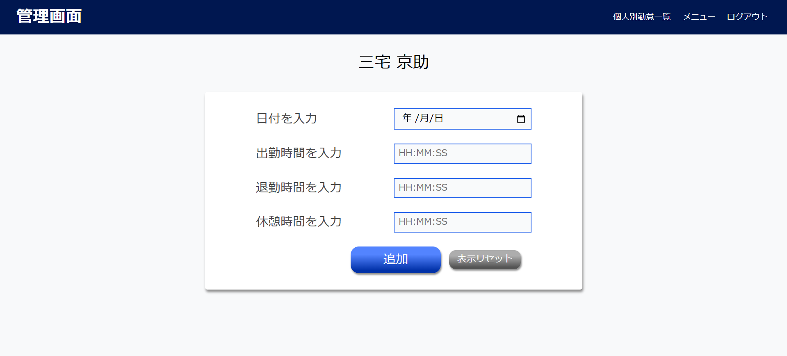

# 勤怠管理システム～Attendance management system～


**こちらは勤怠管理システムのフロントエンドになります。**

> [!Note]
> **ご利用にはフロントエンドとバックエンド両方を起動していただく必要があります。**

バックエンドの環境構築を行いバックエンドとDockerを起動してから下記の手順でフロントエンドの環境構築を行い起動することでアプリをご利用いただけます。

下記のURLよりバックエンドの環境構築を行ってください。

## バックエンド リポジトリ URL

https://github.com/basstuba/ams

## 作成した目的

私が日本で働いていた時の勤怠管理の実務経験を踏まえ、どの年代のユーザーでも使いやすいシンプルな打刻画面と勤怠を管理するにあたって必要な機能を揃えた管理画面を持つ勤怠管理アプリを作成したいと思い作成しました。

## 機能一覧

- アカウント作成機能

- ログイン及びログアウト機能

- 打刻機能

   （出勤、退勤、休憩開始、休憩終了）

- 日付別勤怠一覧表示機能

- 個人別勤怠一覧表示機能

- ユーザーアカウント検索機能

- ページネーション機能

- エクスポート機能

   （日付別勤怠一覧及び個人別勤怠一覧をExcelにて出力）

- 打刻修正機能

- 打刻追加機能

## 使用技術

バックエンドの使用技術はバックエンドのREADMEに記載しています。

| 言語・フレームワーク・その他使用技術 | バージョン |
| ------------------ | ----------|
| Nuxt               | 2.18.1    |
| Node.js            | 20.17.0   |
| vue                | 2.7.10    |
| yarn               | 1.22.22   |
| HTML               |           |
| CSS                |           |

## 環境構築

> [!Warning]
> **事前にNode.jsとGit及びGitHubのインストールをお願い致します。**

### Nuxtの構築

1. GitHubからアプリケーションを取得

   任意のディレクトリにて
   ```
   git clone git@github.com:basstuba/ams-frontend.git
   ```
   を実行後

   ```
   cd ams-frontend
   ```
   にてアプリケーションのディレクトリへ移動。

2. yarnをインストール
   ```
   yarn install
   ```
   を実行。

3. ローカルサーバーを起動
   ```
   yarn dev
   ```
   を実行。

**フロントエンドの環境構築は以上になります。バックエンドの環境構築が完了してDockerが起動しているのを確認後、下記のURLにアクセスするとアプリケーションをご利用いただけます。**

## アプリケーション URL

http://localhost:3000

## 各種機能について

### 新規登録画面


#### アカウント作成機能

- お名前、メールアドレス、パスワードを入力し登録ボタンを押して作成します。

### ログイン画面


#### ログイン及びログアウト機能

- メールアドレス、パスワードを入力しログインボタンを押してログインします。
- ログイン後トップページ及び管理画面の右上にある**ログアウト**を押すとログアウトします。

### トップページ


#### 打刻機能

- 勤務開始ボタンをクリックすると休憩開始ボタンと勤務終了ボタンが表示されます。休憩開始ボタンをクリックすると休憩終了ボタンが表示されます。
- 勤務時間は一日に複数回の入力が可能です。早朝勤務して退勤後、夜間再度勤務のような変則勤務も対応可能です。
- 休憩時間も一日に複数回の入力が可能です。拘束時間が長く休憩が複数回ある場合でも対応可能です。

### 管理画面


- ログイン画面より管理者用アカウントでログインすると表示されます。

> [!IMPORTANT]
> **管理者用アカウントの詳細は下記の通りです。**
> - email :
>   ```
>   admin@admin.com
>   ```
> - password :
>   ```
>   adminadmin
>   ```

- 下記の機能は管理画面の各ページよりご利用いただけます。

| 機能        | ページ     |
| ------------------------ | ----------------------------------- |
| 日付別勤怠一覧表示機能     | 日付別勤怠一覧                        |
| 個人別勤怠一覧表示機能     | 個人別勤怠一覧の勤怠確認               |
| ユーザーアカウント検索機能 | 個人別勤怠一覧                        |
| ページネーション機能       | 個人別勤怠一覧                        |
| エクスポート機能          | 日付別勤怠一覧と個人別勤怠一覧の勤怠確認 |
| 打刻修正機能              | 個人別勤怠一覧の勤怠修正               |
| 打刻追加機能              | 個人別勤怠一覧の勤怠追加               |

### 日付別勤怠一覧ページ



#### 日付別勤怠一覧表示機能

- 日付別勤怠一覧ページで日付別勤怠を表示します。デフォルトの日付は前日の日付となっています。
- 日付の左にある矢印をクリックすると前日、右にある矢印をクリックすると翌日が表示されます。

#### エクスポート機能

- 日付別勤怠一覧ページと個人別勤怠一覧の勤怠確認ボタンで表示される月別勤怠一覧ページの右上にあるエクセルに出力ボタンを押すと、表示している勤怠一覧をエクセルデータとしてダウンロードします。

### 個人別勤怠一覧ページ



#### ユーザーアカウント検索機能

- 個人別勤怠一覧ページにてアカウントを名前で検索することができます。

#### ページネーション機能

- 個人別勤怠一覧ページにてアカウントを最大5件までの表示としています。
- 6件以上アカウントが登録されている場合は画面下部にページ番号が表示され、ページ番号をクリックすると6件目以降のアカウントを表示することができます。

#### 個人別勤怠一覧表示機能

- 個人別勤怠一覧の勤怠確認ボタンからページを移動し個人の勤怠を月別で一覧表示します。デフォルトの表示は今月となっています。
- 表示されている月の左にある矢印をクリックすると前月、右にある矢印をクリックすると翌月が表示されます。
- 勤怠の最終行に総労働時間が表示されます。


#### 打刻修正機能

- 打刻間違いを修正する為の機能です。個人別勤怠一覧ページの勤怠修正ボタンからページを移動し打刻の修正を行えます。
- ページを移動後修正したい日付を選択します。


- 表示された時間を修正して修正ボタンを押してください。



#### 打刻追加機能

- 打刻忘れを修正する為の機能です。個人別勤怠一覧ページの勤怠追加ボタンからページを移動し打刻の追加を行えます。
- 日付、出勤時間、退勤時間、休憩時間を入力して追加ボタンを押してください。



## その他

- 環境構築はフロントエンド、バックエンド共にlocalhostでの使用方法となります。

- 打刻画面は携帯電話でも利用出来るようにレスポンシブデザインを設計していますが、管理画面はエクスポート機能がある為携帯電話での利用は想定していません。


