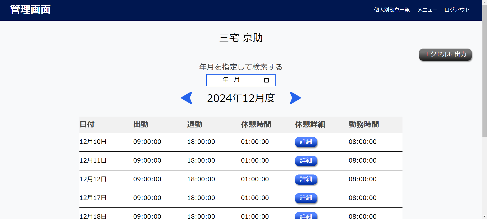
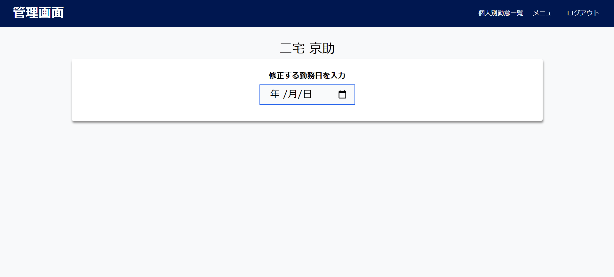

# 勤怠管理システム～Attendance management system～


**こちらは勤怠管理システムのフロントエンドになります。**

> [!Note]
> **ご利用にはフロントエンドとバックエンド両方を起動していただく必要があります。**

バックエンドの環境構築を行いバックエンドとDockerを起動してから下記の手順でフロントエンドの環境構築を行い起動することでアプリをご利用いただけます。

下記のURLよりバックエンドの環境構築を行ってください。

## バックエンド リポジトリ URL

https://github.com/basstuba/ams

## 作成した目的

どなたでも簡単に操作できる勤怠管理アプリを提供したいという思いで作成しました。

私が日本で働いていた時の勤怠管理の実務経験を踏まえ下記の2点を意識して作成しました。

- どの年代のユーザーでも使いやすいシンプルな打刻画面

- 管理者が簡単に扱え尚且つ管理に必要な機能を揃えた管理画面

## 機能一覧

### ユーザーが利用可能な機能

- ログイン及びログアウト機能

- 打刻機能

   （出勤、退勤、休憩開始、休憩終了）

### 管理者が利用可能な機能

- ユーザーアカウント作成機能

- ユーザーアカウント情報変更機能

- インポート機能

   （ユーザーデータを一括登録）

- 日付別勤怠一覧表示機能

- 個人別勤怠一覧表示機能

- ユーザーアカウント一覧表示機能

- ユーザーアカウント検索機能

- 勤怠データ検索機能

- ページネーション機能

- エクスポート機能

   （日付別勤怠一覧及び個人別勤怠一覧をExcelにて出力）

- 打刻修正機能

- 打刻追加機能

## 使用技術

バックエンドの使用技術はバックエンドのREADMEに記載しています。

| 言語・フレームワーク・その他使用技術 | バージョン |
| ------------------ | ----------|
| Nuxt.js            | 2.18.1    |
| Node.js            | 20.17.0   |
| vue.js             | 2.7.10    |
| yarn               | 1.22.22   |
| HTML               |           |
| CSS                |           |

## 環境構築

> [!Warning]
> **事前にNode.jsとGit及びGitHubのインストールをお願い致します。**

### Nuxtの構築

1. GitHubからアプリケーションを取得

   任意のディレクトリにて
   ```
   git clone git@github.com:basstuba/ams-frontend.git
   ```
   を実行後

   ```
   cd ams-frontend
   ```
   にてアプリケーションのディレクトリへ移動。

2. yarnをインストール

   アプリケーションのディレクトリにて
   ```
   yarn install
   ```
   を実行。

3. ローカルサーバーを起動

   アプリケーションのディレクトリにて
   ```
   yarn dev
   ```
   を実行。

**フロントエンドの環境構築は以上になります。バックエンドの環境構築が完了してDockerのamsコンテナが起動しているのを確認後、下記のURLにアクセスするとアプリケーションをご利用いただけます。**

## アプリケーション URL

http://localhost:3000

## 各画面の機能について

### ログイン画面


> [!IMPORTANT]
> **テスト用ユーザーアカウントの詳細は下記の通りです。**
> - email :
>   ```
>   fdsa@fdsa.com
>   ```
> - password :
>   ```
>   fdsafdsa
>   ```

#### ログイン及びログアウト機能

- メールアドレス・パスワードを入力しログインボタンを押してログインしてください。

- ログイン後トップページ及び管理画面の右上にある**ログアウト**を押すとログアウトします。

### トップページ


#### 打刻機能

- 勤務開始ボタンをクリックすると休憩開始ボタンと勤務終了ボタンが表示されます。休憩開始ボタンをクリックすると休憩終了ボタンが表示されます。

- 勤務時間は一日に複数回の入力が可能です。早朝勤務して退勤後、夜間再度勤務のような変則勤務も対応可能です。

- 休憩時間も一日に複数回の入力が可能です。拘束時間が長く休憩が複数回ある場合でも対応可能です。

### 管理画面


- ログイン画面より管理者用アカウントでログインすると表示されます。

> [!IMPORTANT]
> **管理者用アカウントの詳細は下記の通りです。**
> - email :
>   ```
>   admin@admin.com
>   ```
> - password :
>   ```
>   adminadmin
>   ```

管理画面の各ページより各機能をご利用いただけます。

- 日付別勤怠一覧ページ

   - 日付別勤怠一覧表示機能

   - エクスポート機能

   - 勤怠データ検索機能

- 個人別勤怠一覧ページ

   - ユーザーアカウント一覧表示機能

   - ユーザーアカウント検索機能

   - 個人別勤怠一覧表示機能

   - 勤怠データ検索機能

   - 打刻修正機能

   - 打刻追加機能

   - エクスポート機能

   - ページネーション機能

- 従業員登録ページ

   - ユーザーアカウント作成機能

   - インポート機能

- 従業員情報変更ページ

   - ユーザーアカウント情報変更機能

### 日付別勤怠一覧ページ


#### 日付別勤怠一覧表示機能

- 日付別勤怠一覧ページで日付別勤怠を表示します。デフォルトの日付は前日の日付となっています。

- 日付の左にある矢印をクリックすると前日、右にある矢印をクリックすると翌日が表示されます。

#### エクスポート機能

- 日付別勤怠一覧ページの右上にある**エクセルに出力**ボタンを押すと、表示している勤怠一覧をエクセルデータとしてダウンロードします。

#### 勤怠データ検索機能

- 日付・社員区分・所属部門の3項目で検索することができます。

- 日付の検索は2020年4月に労働基準法が改正され賃金請求権の消滅時効が5年に延長されたことを踏まえ、現在は2020年1月1日まで選択可能としています。

### 個人別勤怠一覧ページ


#### ユーザーアカウント一覧表示機能

- 個人別勤怠一覧ページにて登録済ユーザーアカウントの一覧を表示します。

#### ユーザーアカウント検索機能

- 個人別勤怠一覧ページにてユーザーアカウントを名前・社員番号・社員区分・所属部門の4項目で検索することができます。

#### ページネーション機能

- 個人別勤怠一覧ページにてアカウントを最大5件までの表示としています。
- 6件以上アカウントが登録されている場合は画面下部にページ番号が表示され、ページ番号をクリックすると6件目以降のアカウントを表示することができます。

#### 個人別勤怠一覧表示機能

- 個人別勤怠一覧ページの勤怠確認ボタンからページを移動し個人の勤怠を月別で一覧表示します。デフォルトの表示は今月となっています。

- 表示されている月の左にある矢印をクリックすると前月、右にある矢印をクリックすると翌月が表示されます。

- 勤怠の最終行に総労働時間が表示されます。




#### エクスポート機能

- 個人別勤怠一覧ページの勤怠確認ボタンで移動したページの右上にある**エクセルに出力**ボタンを押すと、表示している勤怠一覧をエクセルデータとしてダウンロードします。

#### 勤怠データ検索機能

- 日付で検索することができます。

- 日付の検索は2020年4月に労働基準法が改正され賃金請求権の消滅時効が5年に延長されたことを踏まえ、現在は2020年1月度まで選択可能としています。

#### 打刻修正機能

- 打刻間違いを修正する為の機能です。個人別勤怠一覧ページの勤怠修正ボタンからページを移動し打刻の修正を行えます。

1. ページを移動後修正したい日付を選択します。



2. 表示された時間を修正して修正ボタンを押してください。


#### 打刻追加機能

- 打刻忘れを修正する為の機能です。個人別勤怠一覧ページの勤怠追加ボタンからページを移動し打刻の追加を行えます。

- 日付、出勤時間、退勤時間、休憩時間を入力して追加ボタンを押してください。


### 従業員登録ページ


- ユーザーアカウントの作成・管理の権限を管理者のみにしています。この運用により、アカウント情報の一元管理が可能となり、不正なアカウント作成や情報の漏洩を防止します。また、管理者が各ユーザーの登録情報を容易に把握・修正できる環境を提供します。

- ユーザーアカウントの登録方法は1件づつ登録する**個別登録**とcsvファイルでまとめて登録する**一括登録**の2つの方法を選択可能です。

#### ユーザーアカウント作成機能

- 従業員登録方法選択の個別登録を押し、移動したページにてユーザーアカウントの作成を行えます。

- 氏名・メールアドレス・パスワード・社員番号・社員区分・所属部門を入力して登録ボタンを押してください。

> [!IMPORTANT]
> - 社員番号は0を含む5桁の数字という設定になっていますので5桁の数字で入力してください。
>
> - 社員番号を重複しての使用はできません。
>
> - 各アカウントの社員番号は下記の通りとなっていますので下記の番号以外の番号を使用してください。
>
> | アカウント名              | 社員番号     |
> | ------------------------ | ----------- |
> | 管理者用アカウント        | 00000        |
> | テスト用ユーザーアカウント | 00001        |
> | ダミーデータのアカウント   | 00002~00051 |
>
> - 所属部門には"無し"という項目も用意しましたので所属部門という項目が不要な場合は"無し"を選択してください。


#### インポート機能

- 従業員登録方法選択の一括登録を押し、移動したページにてcsvファイルを使用してアカウントの一括登録を行えます。

- 登録したいアカウントデータのcsvファイルを選択して登録ボタンを押してください。

> [!IMPORTANT]
> csvファイルの作成方法は後述の"その他"に記載しています。


### 従業員情報変更ページ


#### ユーザーアカウント情報変更機能

- 登録されているユーザーアカウントの情報を変更を行えます。

- 変更したいユーザーアカウントの選択間違いを防止する為に各ユーザー固有の番号である社員番号で検索します。

1. 変更したいユーザーアカウントの社員番号を入力して検索します。

2. 変更したい項目を修正し変更ボタンを押してください。


## その他

### csvファイルの作成方法

#### Excelで作成する場合


1. 1行目に画像の通り各項目の名称を記述してください。

2. 社員番号の列を示す"D"を右クリックし"セルの書式設定"をクリック。続けて表示形式の分類で文字列を選択してOKを押してください。

3. 2行目から各項目にユーザーの情報を記述してください。

4. メニューバーにある"ファイル"をクリック。

5. "名前を付けて保存"をクリック。

6. 保存場所を選択。

7. ファイル名を記入。

8. ファイルの種類は"CSV UTF-8 （コンマ区切り）"を選択。

9. 保存をクリックして完了です。

#### Googleスプレッドシートで作成する場合

- 作成用の雛形シートをご用意いたしましたので下記URLからご利用ください。雛形シートには10件のダミーデータを記載しています。

- スプレッドシートURL

   https://docs.google.com/spreadsheets/d/1OXB0O3aGBojU1kVIwLXo0tTojIeurTx32EYgkoB_GeE/edit?gid=0#gid=0

- 追加で作成する場合

   1. 1行目は各項目の名称となりますので、2行目から各項目にユーザーの情報を記述してください。

   2. ユーザー情報の記述後メニューバーにある'ファイル'をクリック。

   3. ダウンロードにカーソルを移動。

   4. カンマ区切り形式（.csv）をクリックし、ダウンロードすると完了です。

### 補足

- 環境構築はフロントエンド、バックエンド共にローカルサーバーでの使用方法となります。

- 打刻画面は携帯電話でも利用出来るようにレスポンシブデザインを設計していますが、管理画面はエクスポート機能がある為携帯電話での利用は想定していません。


